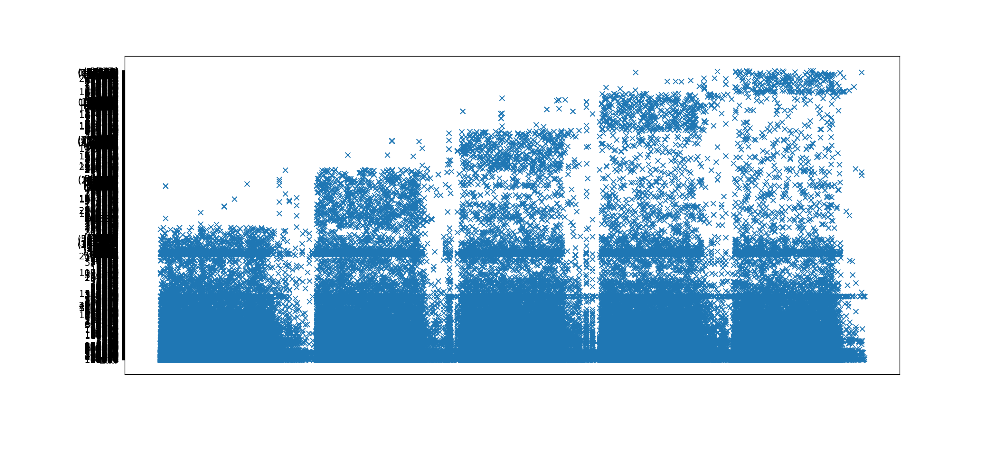

# EECS731_Project05

### Shipping and delivering to a place near you
1. Set up a data science project structure in a new git repository in your GitHub account
2. Download the product demand data set from
https://www.kaggle.com/felixzhao/productdemandforecasting
3. Load the data set into panda data frames
4. Formulate one or two ideas on how feature engineering would help the data set to establish additional value using exploratory data analysis
5. Build one or more forecasting models to determine the demand for a particular product using the other columns as features
6. Document your process and results
7. Commit your notebook, source code, visualizations and other supporting files to the git repository in GitHub

### Establish additional value using exploratory data analysis

The problem represented by this data set is a type of time-based prediction problem. We can use the data on the past time axis to find the relationship between the data and the time period, or the relationship between the data on the time axis.

Through the data set, we can know that it has five data attributes, namely Product_Code, Warehouse, Product_Category, Date and Order_Demand.

First, we look at the overall trend through the relationship between construction time and Order Demand.

As can be seen from the figure, the overall demand has shown a substantial growth trend.

After comparing the differences in the data, we found that the types of Warehouses are less different. There is almost no effect on the overall data. So we delete this part.

Since we found that the data set contains a large number of products, and each product is different, we must analyze different products so that the data obtained will be more effective. Taking our statistical data as an example, `product 1359` has the largest order demand. From this perspective, we can focus our productivity on these products with high demand. But for these high-demand products, we don't know if there is a big demand all the time.

I combine all orders in the same day, and create a function for each product (here I used `product 1359` as an example).

### Comparison
I pick up 3 models for this dataset, LinearRegression, GradientBoostingRegressor and NeuralNetwork.

LinearRegression          === 0.03415167801376984
GradientBoostingRegressor === 0.9540622232910662
NeuralNetwork             === 1.847871564530923e-05

GradientBoostingRegressor get the best result.
